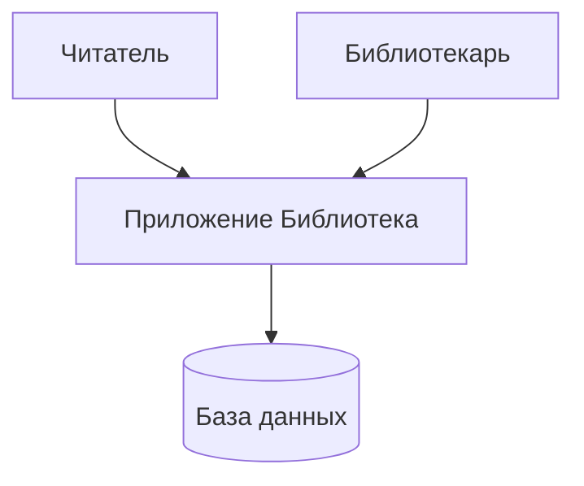

# Кейс: Библиотека — Контекстная диаграмма

## Внешние сущности
| Сущность | Роль |
|----------|------|
| Читатель | Ищет книги, бронирует, просматривает каталог |
| Библиотекарь | Управляет каталогом, выдаёт книги |

## Границы системы
- Каталог книг (поиск по названию/автору)
- Статусы книг (в наличии / на руках / забронирована)
- Бронирование на 3 дня
- Лимит: не более 3 активных броней
- Автоснятие брони через 3 дня

## Mermaid

