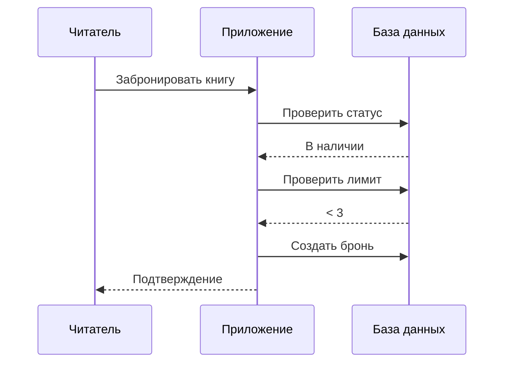

# Кейс: Библиотека — Sequence

## Диаграмма последовательности

```mermaid
sequenceDiagram
    participant Reader as Читатель
    participant App as Приложение
    participant DB as База данных

    Reader->>App: Забронировать книгу
    App->>DB: Проверить статус
    DB-->>App: В наличии
    App->>DB: Проверить лимит
    DB-->>App: < 3
    App->>DB: Создать бронь
    App-->>Reader: Подтверждение
```
