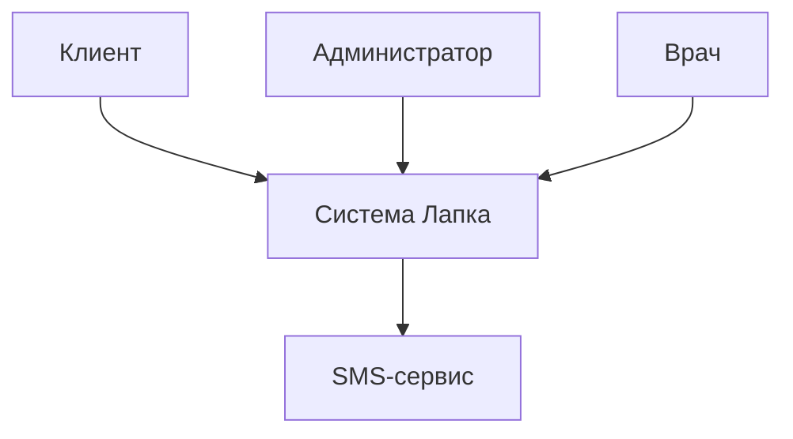

# Кейс: Ветклиника — Контекстная диаграмма

## Внешние сущности
| Сущность | Роль |
|----------|------|
| Клиент | Записывается, отменяет запись |
| Администратор | Управляет расписанием |
| Врач | Видит свою запись |
| SMS-сервис | Отправляет напоминания |

## Границы системы
- Запись к врачу (выбор специалиста, даты, времени)
- Отмена записи
- Напоминание за день
- Слоты 30 мин, 9:00-20:00
- Понедельник — выходной
- У врачей неполный день

## Mermaid

