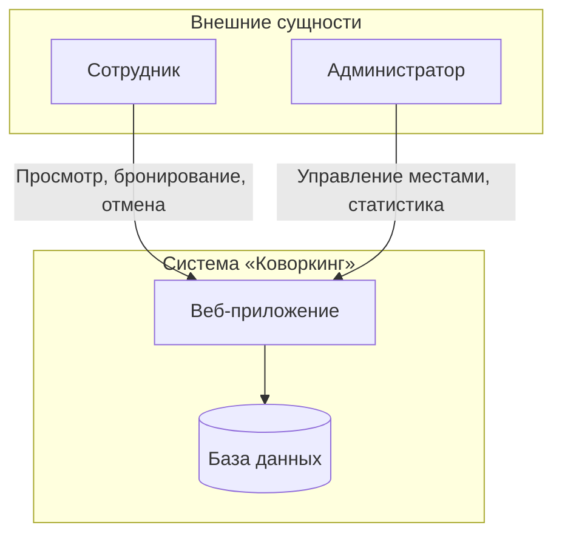

# Кейс: Система бронирования рабочих мест в коворкинге

## Контекстная диаграмма

### Внешние сущности
| Сущность | Роль |
|----------|------|
| Сотрудник | Бронирует место, отменяет бронь, смотрит план зала |
| Администратор | Управляет списком мест, смотрит статистику |

### Границы системы (что внутри)
- Просмотр плана зала
- Бронирование места на конкретную дату
- Отмена бронирования
- Управление списком мест (админ)
- Статистика бронирований (админ)

### Что снаружи (НЕ делаем)
- Мобильное приложение (только веб)
- Интеграция с календарями
- Оплата бронирования

### Диаграмма (Mermaid)

