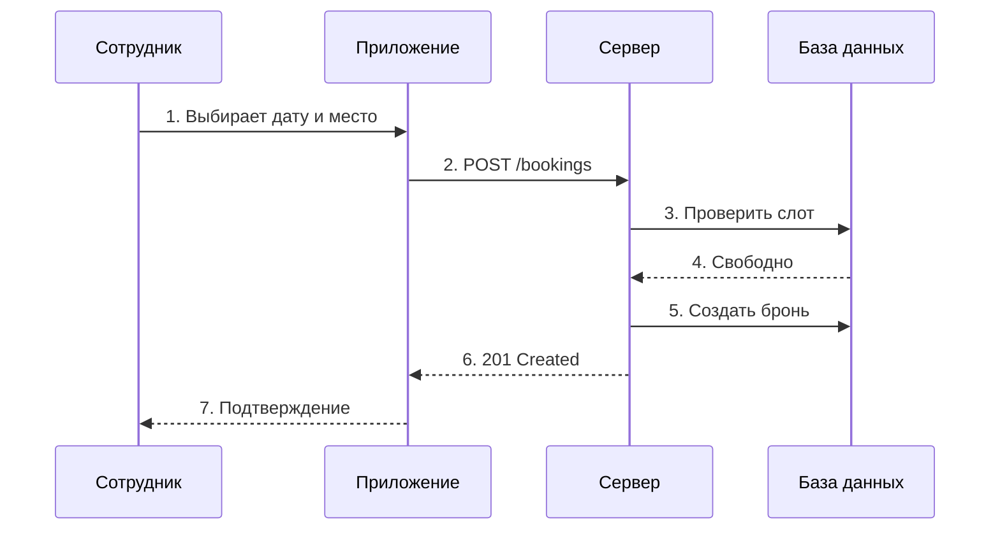

# Кейс: Коворкинг — Диаграмма последовательности

## Сценарий: Сотрудник успешно бронирует место

```mermaid
sequenceDiagram
    participant Employee as Сотрудник
    participant App as Приложение
    participant Server as Сервер
    participant DB as База данных

    Employee->>App: 1. Выбирает дату и место
    App->>Server: 2. POST /bookings
    Server->>DB: 3. Проверить слот
    DB-->>Server: 4. Свободно
    Server->>DB: 5. Создать бронь
    Server-->>App: 6. 201 Created
    App-->>Employee: 7. Подтверждение
```
