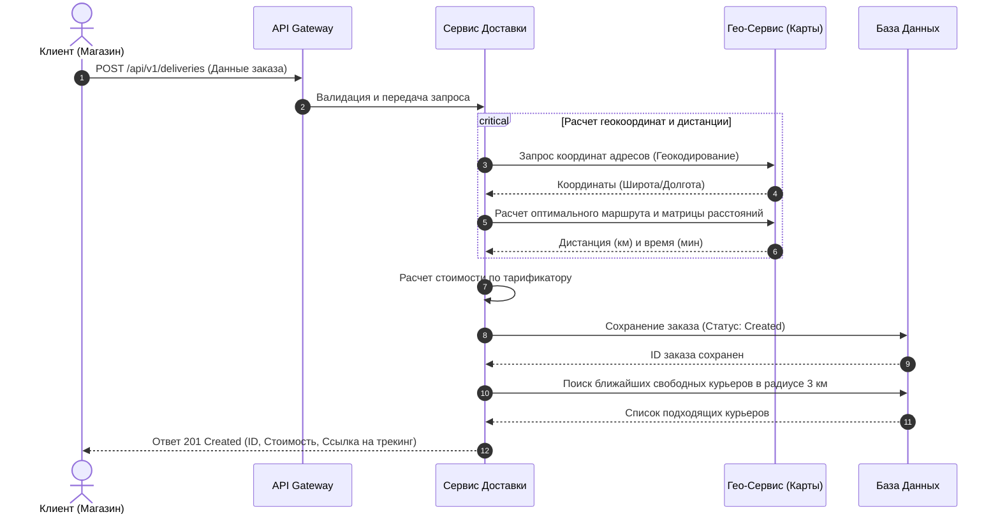

# Диаграмма последовательности: Создание заказа и подбор курьера



# Sequence Diagram — автоматическое переназначение заказа

```mermaid
sequenceDiagram
    participant K1 as Курьер 1
    participant K2 as Курьер 2
    participant S as Система
    participant O as Оператор

    K1->>S: Отмечает "В пути"
    S->>S: Запускает таймер критического времени

    alt Время истекло
        S->>S: Ищет свободного курьера в радиусе 3 км
        alt Свободный курьер найден
            S->>K2: Предложение взять заказ
            K2->>S: Принимает заказ
            S->>K1: Уведомление об отмене (время истекло)
            S->>O: Уведомление о переназначении
            S->>K2: Детали заказа и маршрут
        else Свободный курьер не найден
            S->>O: Эскалация: заказ рискует остыть
            S->>K1: Уведомление: "Поторопитесь!"
        end
    else Время в норме
        S->>K1: Статус: "В пути"
    end
