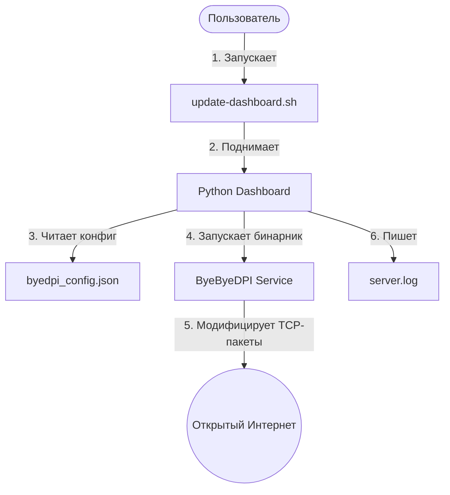
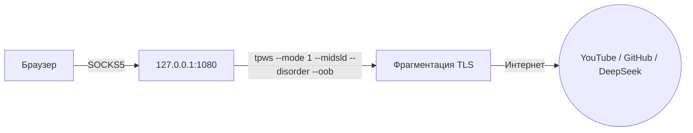

# Исследование и автоматизация: Локальный дашборд для ByeByeDPI

Кейс демонстрирует навыки работы с сетевыми протоколами, конфигурацией ПО в среде Linux (Ubuntu), анализа логов и создания легковесных интерфейсов на Python для управления системными утилитами.

## 1. Архитектурная схема решения

Процесс автоматизации и маршрутизации трафика выглядит следующим образом:



## 2. Архитектура решения и ключевая идея

Обход DPI поднимается как **локальный SOCKS5-прокси на порту 1080**.  
Вся система продолжает работать напрямую, а обход используется только для заблокированных сайтов (через браузер или приложения, поддерживающие прокси).



### 🛠️ Параметры комбо-стратегии `tpws`:

| Параметр | Эффект / Описание |
| :--- | :--- |
| `--mode 1` | **Перехват**: Модификация и расщепление TLS-пакетов. |
| `--midsld` | **«Ослепление» DPI**: Маскировка метаданных Host/SNI. |
| `--disorder` | **Перемешивание**: Изменение порядка отправки TCP-пакетов для сбивания анализаторов. |
| `--oob` | **Out-of-Band**: Внедрение внеполосных данных для обхода проверок. |

---

## 3. Спецификация конфигурационного файла (JSON-контракт)

Для управления параметрами расщепления пакетов используется файл `config/byedpi_config.json`:

```json
{
  "connection_settings": {
    "host": "127.0.0.1",
    "port": 8080,
    "max_connections": 500
  },
  "dpi_evasion_modes": {
    "split_http_req_buffer": true,
    "split_pos": 2,
    "change_packet_case": true,
    "fake_packets_count": 1
  },
  "auto_update": {
    "enabled": true,
    "check_interval_hours": 24
  }
}
```

---

## 4. Проверенные Hard Skills в кейсе
* **Сетевые технологии:** Понимание принципов работы DPI (Deep Packet Inspection), структуры TCP/IP пакетов, DNS и SSL/TLS хендшейков.
* **Системное администрирование:** Написание автоматизационных Bash-скриптов для Linux Ubuntu, управление фоновыми процессами.
* **Разработка прототипов:** Быстрое создание админ-панелей на Python для визуализации системных логов (`server.log`).
